# MonoSearch

MonoSearch is a simplified implementation of DeepSearch for learning purposes. It provides a modular search engine framework that helps to understand the core working principles of deep search systems.

## Workflow

```mermaid
flowchart LR
    Query[User Query] -->|Input| QA[fa:fa-brain Query Analyzer]
    QA -->|Generate Keywords| Ret[fa:fa-search Retriever]
    Ret -->|Retrieve Documents| Rank[fa:fa-sort-amount-down Ranker]
    Rank -->|Rank/Filter Documents| Ref[fa:fa-sync-alt Reflex]
    Ref -->|Determine if continue| Cont{fa:fa-question-circle Continue?}
    Cont -->|Yes| NewQ[fa:fa-edit New Queries]
    NewQ -->|New Keywords| Ret
    Cont -->|No| Sum[fa:fa-file-alt Summarizer]
    Sum -->|Generate Answer| Result[fa:fa-check-circle Search Result]
    
    classDef primary fill:#f9f7f7,stroke:#3f72af,stroke-width:2px,color:#112d4e;
    classDef secondary fill:#dbe2ef,stroke:#3f72af,stroke-width:2px,color:#112d4e;
    classDef decision fill:#f9f7f7,stroke:#d63031,stroke-width:2px,color:#112d4e;
    classDef result fill:#d8e3e7,stroke:#126e82,stroke-width:2px,color:#132c33;
    
    class Query,QA,Ret,Rank,Ref,NewQ,Sum primary;
    class Cont decision;
    class Result result;
```



## Project Architecture

MonoSearch adopts a modular, loosely coupled, and pluggable design, comprising the following core modules:

1. **Query Analyzer**: Analyzes user queries and breaks them down into multiple potential keywords
2. **Retriever**: Responsible for searching and retrieving documents relevant to the query
3. **Ranker**: Sorts and filters the retrieved documents
4. **Reflex**: Based on current results, determines whether additional queries are needed
5. **Summarizer**: Compiles the search process and results to generate the final answer

All modules share a SearchContext to facilitate parameter sharing and result passing.

## Installation

Install dependencies using the uv package manager:

```bash
uv add -r requirements.txt
```

## Environment Variables Configuration

MonoSearch uses the following environment variables:

- `BOCHA_API_KEY`: Search service API key
- `SILICON_FLOW_API_KEY`: Required if using Silicon Flow service

You can set environment variables as follows:

```bash
# Linux/MacOS
export BOCHA_API_KEY="your_api_key"
export SILICON_FLOW_API_KEY="your_silicon_flow_api_key"
```

## Usage

### Basic Usage

```python
from monosearch import MonoSearch
from monosearch.datatypes.common import LlmConfig

# Create a search engine instance
search_engine = MonoSearch()

# Configure the language model
model_config = LlmConfig(
    model_name = "Qwen/Qwen3-8B"  # Options include: "Pro/deepseek-ai/DeepSeek-V3", etc.
)

# Perform search
results = search_engine.search("How to implement a simple search engine", model_config, max_iterations=3)
print(results)
```

### Running Examples

The project includes example code. The `simple_search.py` example requires a command-line input for queries:

```bash
# Run with your search query
uv run examples/simple_search.py "What is quantum computing"
```

You must specify your search query as a command-line argument.

## Custom Development

MonoSearch is designed as an extensible modular system. You can implement your own modules by inheriting from base classes:

### Implementing a Custom Retriever

```python
from monosearch.retriever import BaseRetriever
from monosearch.datatypes.common import SearchContext, Document

class MyCustomRetriever(BaseRetriever):
    def retrieve_single(self, query: str, context: SearchContext) -> List[Document]:
        # Implement your own retrieval logic
        documents = []
        # ...
        return documents
```

### Creating a Custom Search Engine

```python
from monosearch import MonoSearch
from monosearch.query_analyzer import CustomQueryAnalyzer
from monosearch.ranker import CustomRanker

# Create a search engine with custom components
custom_search = MonoSearch(
    query_analyzer=CustomQueryAnalyzer(),
    retriever=MyCustomRetriever(),
    ranker=CustomRanker()
)

results = custom_search.search("query content")
```

Each module has corresponding base classes and default implementations. You can choose to inherit and override specific functionalities as needed.
